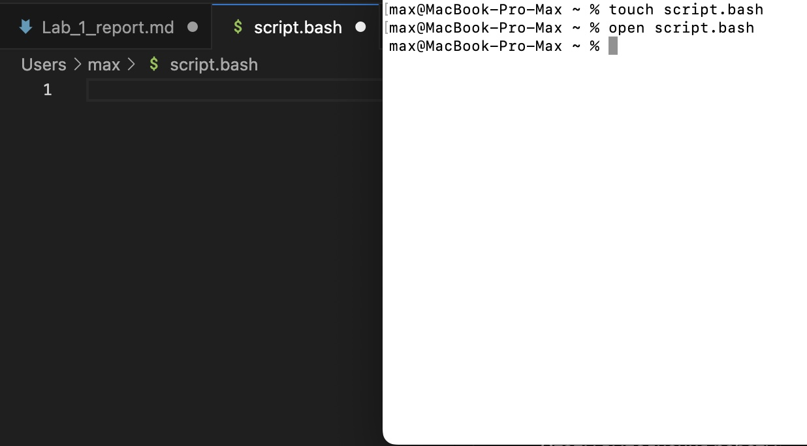
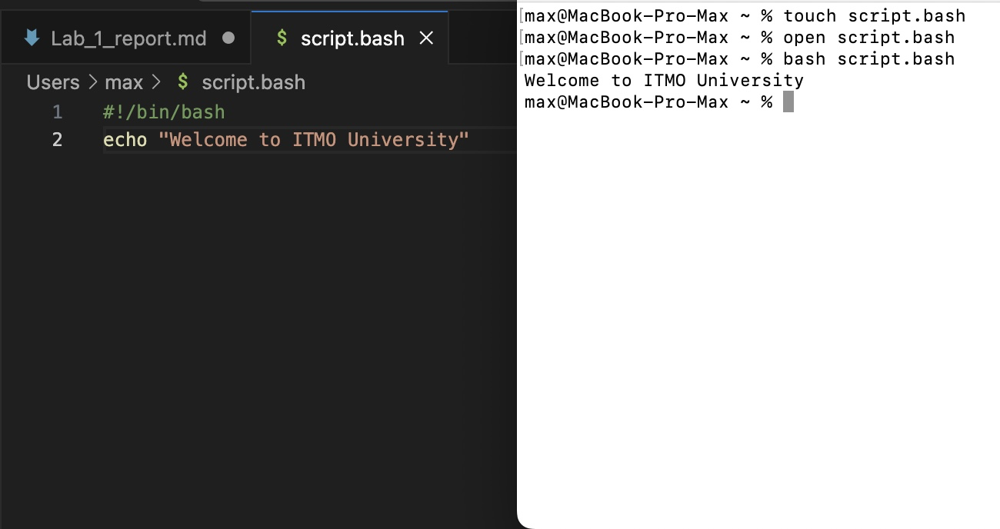
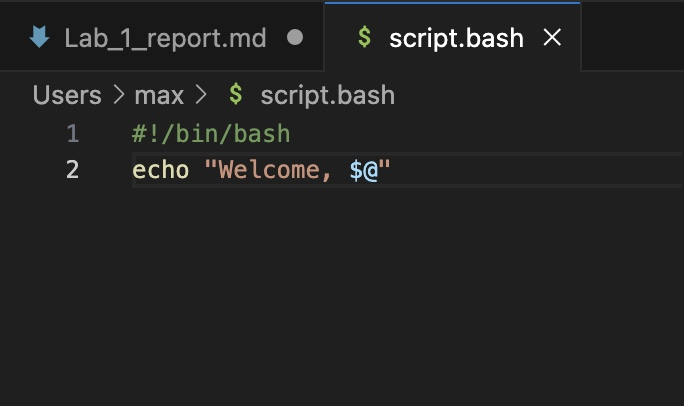
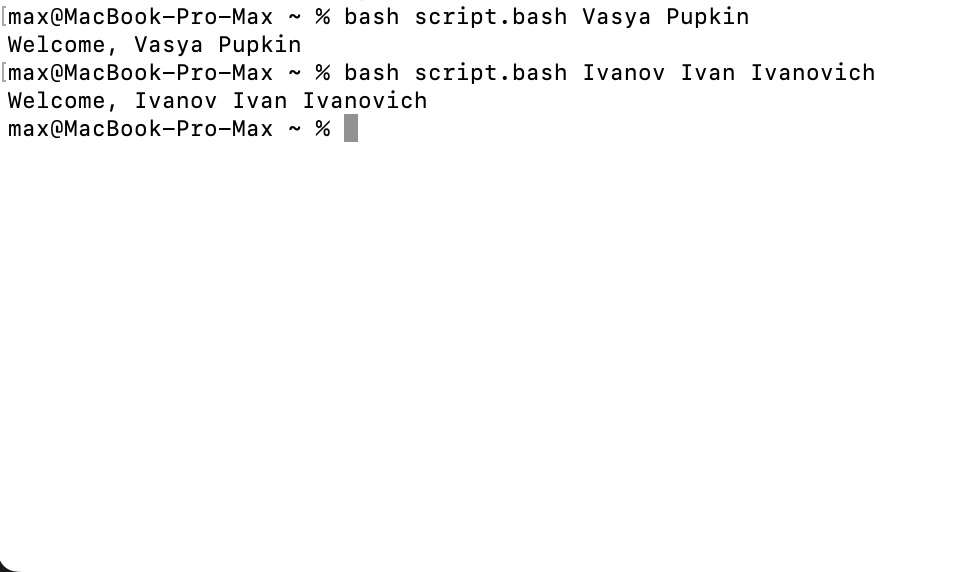

# Отчет по лабораторной работе №1
Цель лабораторной работы: модификация исходного файла таким образом, чтобы при вводе пользователем своих данных они считывались и выводились в терминал.

Этапы выполнения работы:

1. Создание нового репозитория и файла Lab_1_report.md для будущего отчета
2. Знакомство со встроенным терминалом на MacOS и с его основными командами
3. Создание и открытие файла script.bash

4. Запись скрипта и сохранение файла с последующим запуском bash-скрипта

5. Модификация файла и проверка вывода:

   Модификация:
   
   Проверка вывода:
   
7. Написание и загрузка отчета о проделанной работе
   

